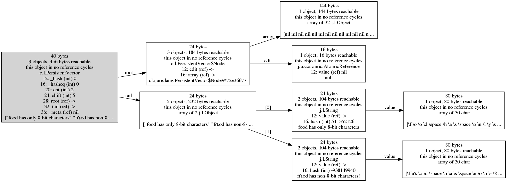

# Compressed pointers in 64-bit JVMs

In looking at these figures, you may have noticed that the byte
offsets of the fields only differ by 4 between most fields, even for
references.  Those references should be pointers between Java objects
in memory.  So why are they only 4 bytes long?  When you are running a
64-bit JVM, shouldn't they be 8 bytes in size, to hold a 64-bit
address?

In most cases, they are only taking up 4 bytes of storage, due to a
memory optimization in most JVMs called "Compressed Pointers".  [Here
is one article](https://www.baeldung.com/jvm-compressed-oops)
describing them in more detail.

The basic idea is that because JVM memory allocation always aligns the
starting address of objects to be multiples of 8 bytes, the least
significant 3 bits of all memory addresses are 0.  If you specify a
maximum heap size of (8 * 4 GBytes) = 32 GBytes or less when starting
the JVM, all 64-bit addresses can be shifted right by 3 bit positions,
and the result will always fit within 32 bits, with no loss of
information.

I have used the `-XX:-UseCompressedOops` option of the JVM to disable
this option, and you can see the difference in results below.

The next figure below shows the results with the default JVM behavior
where compressed pointers are enabled.  I have read that this is the
default behavior since Java 7, when the max heap size is 32 GBytes or
less.  The leftmost object with type `PersistentArrayMap` has field
`array` starting at offset 20 bytes from the beginning of the object,
and it is a reference.  The next field starts at offset 24 bytes, so
`array` only occupies 4 bytes.

Other examples include the `value` field in the two objects with type
`String`.

The next figure below shows the results with compressed pointers
disabled via the `-XX:-UseCompressedOops` command line option when
starting the JVM.

Here the field `array` in the leftmost object has offset 24, and the
immediately following field has offset 32, so `array` occupies 8
bytes.  Similarly for the size of the `value` fields of the objects
with type `String`.

No offsets are shown for each array element in the object with type
`array of 4 j.l.Object`, but you can see that it occupies 56 bytes
total, whereas in the previous figure it only occupied 32 bytes.

Another difference to note is that the minimum offset of any field in
this figure is 16 bytes, whereas several fields in the figure above
start at offset 12 bytes.  I believe that the common "header" fields
at the beginning of every object in the JVM include a reference that
is not shown in these figures, and this is also 8 bytes instead of 4
bytes when compressed pointers are disabled.

# Compact strings in Java 9 and later

In Java 8 and earlier, the default was for strings to be represented
in memory as arrays of Java `char`, which are 2 bytes each.  If most
of the strings you represent are within the ASCII subset, then this is
twice as much memory as they need, but it enables strings to be
handled consistently throughout the Java library whether they use a
larger subset of the full Unicode character set, or not.

Java 9 introduced [Compact
strings](https://www.codenuclear.com/compact-strings-java-9), where if
a string contains only characters whose code points fit within a
single 8-bit byte, then it is stored in memory using only 1 byte per
character.

`cljol` can make this easy to see, by using it to analyze a string
like `"food has only 8-bit characters"` containing exactly 30
characters, all within the ASCII subset, and a another string like
`"f\u1234od has non-8-bit characters!"` that also contains exactly 30
characters, but one of them requires more than 8 bits to represent its
Unicode code point -- it is the one represented using Java and
Clojure/Java's `\u1234` syntax, which means a single character with
code point of 1234 hexadecimal.

Examine the first figure below, generated using JDK 1.8.0_192.  Notice
that both strings have a reference to an array of 30 Java chars, where
each of those chars take 2 bytes of storage:

Now look at the similar figure below, generated using JDK 9.0.4.  The
string that contains only 8-bit characters has a reference to an array
of 30 bytes, whereas the string that has a character that cannot be
represented in 8 bits has a reference to an array of 60 bytes.  The
Java library stores the difference in the array encoding via the field
`coder` in the object of type `java.lang.String` that references the
byte array.

